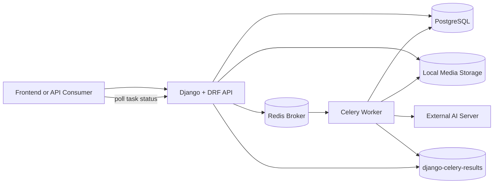
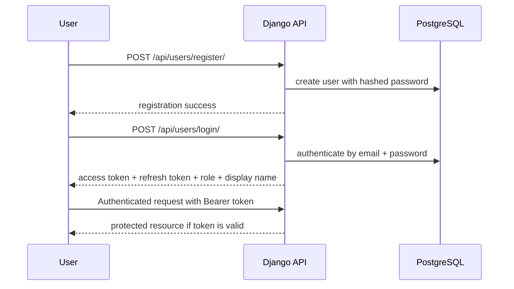
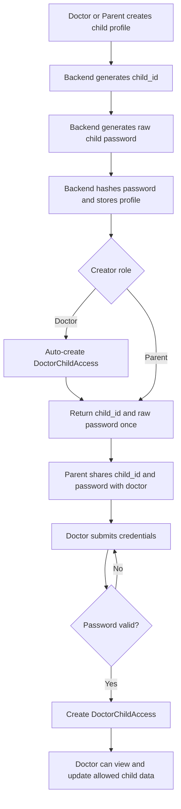
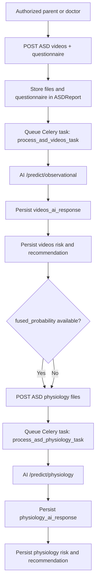
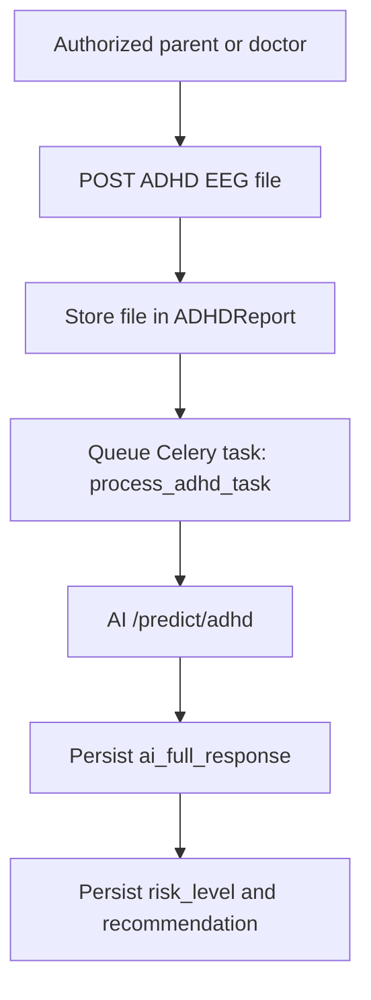
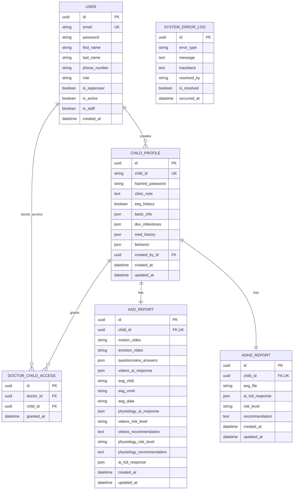
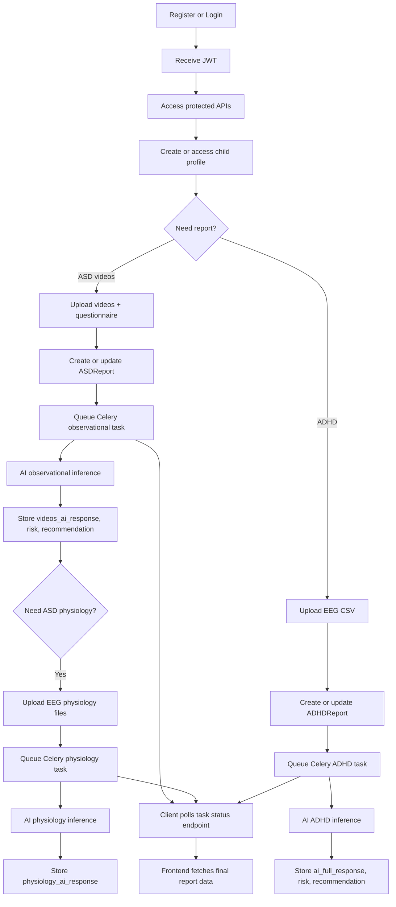

# Graduation Test Backend

Backend service for a child assessment platform built with Django, Django REST Framework, JWT authentication, PostgreSQL, Redis, Celery, and filesystem-based media storage. The backend manages users, child profiles, doctor access control, ASD/ADHD report workflows, asynchronous AI processing, and error logging.

## Table of Contents

- [System Summary](#system-summary)
- [Technology Stack](#technology-stack)
- [Project Layout](#project-layout)
- [Runtime Architecture](#runtime-architecture)
- [Application Modules](#application-modules)
- [Authentication and Authorization](#authentication-and-authorization)
- [Child Profile Workflow](#child-profile-workflow)
- [Report Processing Workflow](#report-processing-workflow)
- [Asynchronous Task Lifecycle](#asynchronous-task-lifecycle)
- [Database Model Reference](#database-model-reference)
- [API Reference](#api-reference)
- [Media and File Storage](#media-and-file-storage)
- [Database Backups in Repository](#database-backups-in-repository)
- [Migrations and Schema Evolution](#migrations-and-schema-evolution)
- [Admin Interface](#admin-interface)
- [Testing Status](#testing-status)
- [Operational Notes and Current Constraints](#operational-notes-and-current-constraints)

## System Summary

This repository contains one Django project under `core/` with four local apps:

- `users`: custom user model, login, registration, profile management, dashboards, and role-based permissions.
- `children`: child records, one-time doctor access credentials, doctor access grants, clinic notes, and child profile updates.
- `reports`: ASD and ADHD diagnosis/report endpoints, file uploads, Celery tasks, AI server calls, and task polling.
- `errors`: persistent storage for backend and AI-integration failures.

The backend is API-first. Most business operations are exposed under `/api/...`, while Django Admin remains available under `/admin/`.

## Technology Stack

- Python / Django 5.2.13
- Django REST Framework
- `djangorestframework-simplejwt` for JWT authentication
- PostgreSQL as the primary relational database
- Redis as the Celery broker
- `django-celery-results` as the Celery result backend
- Local filesystem media storage via Django `FileField`
- External AI inference server configured by `AI_SERVER_URL`

## Project Layout

```text
graduation-test/
├── README.md
└── core/
    ├── manage.py
    ├── core/
    │   ├── __init__.py
    │   ├── asgi.py
    │   ├── celery.py
    │   ├── settings.py
    │   ├── urls.py
    │   └── wsgi.py
    ├── users/
    ├── children/
    ├── reports/
    ├── errors/
    ├── media/
    ├── db_backup.sql
    └── fixed_backup.sql
```

## Runtime Architecture



### Request Handling Model

1. A client authenticates using email/password and receives JWT tokens.
2. Authenticated requests hit Django REST API endpoints.
3. Synchronous operations write directly to PostgreSQL and sometimes to media storage.
4. Heavy report analysis is offloaded to Celery.
5. Celery workers read uploaded media files, call the external AI server, persist results, and expose task state through `django-celery-results`.

## Application Modules

### `users`

Responsibilities:

- Defines the custom `User` model.
- Uses email as the login identifier.
- Supports `admin`, `doctor`, and `parent` roles.
- Exposes registration, login, profile, and dashboard endpoints.
- Provides reusable role-based permission classes.

### `children`

Responsibilities:

- Stores child profiles using a readable public `child_id`.
- Generates a random one-time child password when a profile is first created.
- Hashes child passwords before persistence.
- Supports doctor access grants using `child_id + password`.
- Supports creator-only password regeneration.
- Supports doctor-only clinic notes.
- Stores structured child data inside JSON fields.

### `reports`

Responsibilities:

- Stores ASD and ADHD uploads and AI outputs.
- Splits ASD into two stages:
  - observational stage: videos + questionnaire
  - physiology stage: EEG-related files, dependent on observational output
- Offloads AI processing to Celery tasks.
- Exposes task-status polling.
- Returns richer report details to doctors than to parents.

### `errors`

Responsibilities:

- Persists backend-side integration failures in `SystemErrorLog`.
- Captures AI connectivity errors, request errors, and generic task failures.

## Authentication and Authorization

### User Model

The system uses a custom user model configured by:

- `AUTH_USER_MODEL = 'users.User'`
- `USERNAME_FIELD = 'email'`

Stored user fields:

- `id` as UUID primary key
- `first_name`
- `last_name`
- `email` as unique login key
- `phone_number`
- `role`
- `is_active`
- `is_staff`
- `created_at`

### JWT Strategy

Configured in `core/settings.py`:

- Access token lifetime: 12 hours
- Refresh token lifetime: 7 days
- Refresh rotation enabled
- Authorization header type: `Bearer`

### Default Permission Baseline

Global DRF defaults require:

- JWT authentication
- authenticated access

Only endpoints that explicitly set `AllowAny` bypass authentication.

### Role Permission Classes

Defined in `users/permissions.py`:

- `IsAdmin`
- `IsDoctor`
- `IsParent`
- `IsDoctorOrParent`
- `IsAdminOrDoctor`

These classes enforce role checks using `request.user.role`.

### Authentication Flow



## Child Profile Workflow

### Data Shape

`ChildProfile` mixes fixed relational columns with structured JSON sections:

- fixed columns:
  - `id`
  - `child_id`
  - `hashed_password`
  - `clinic_note`
  - `eeg_history`
  - `created_by`
  - `created_at`
  - `updated_at`
- JSON sections:
  - `basic_info`
  - `dev_milestones`
  - `med_history`
  - `behavior`

### Child ID and Child Password

When a child is first created:

- a public identifier like `CHLD-A3F9X2` is generated
- an 8-character random password is generated
- the password is hashed into `hashed_password`
- the raw password is temporarily attached to the model instance and returned once in the API response

That raw password is the credential a parent can share with a doctor to authorize access.

### Child Creation Rules

- both parents and doctors can create child profiles
- creator is stored in `created_by`
- if the creator is a doctor, the backend automatically creates a `DoctorChildAccess` row for that doctor and child

### Child Access Rules

- parents can access children they created
- doctors can access:
  - children they created
  - children for which they obtained access through `DoctorChildAccess`

### JSON Update Behavior

Child profile updates are partial and merge JSON content instead of replacing the full section. For example, updating one field inside `basic_info` preserves the other existing `basic_info` keys.

### Clinic Notes

- only doctors can update clinic notes
- the doctor must already have authorized access to the child

### Password Regeneration

- only the original creator can regenerate a child password
- regeneration replaces the stored hash
- the new raw password is returned in the API response

### Child Workflow Diagram



## Report Processing Workflow

### ASD Report Model

`ASDReport` is one-to-one with a child and stores:

- stage 1 inputs:
  - `motion_video`
  - `emotion_video`
  - `questionnaire_answers`
- stage 1 AI output:
  - `videos_ai_response`
  - `videos_risk_level`
  - `videos_recommendation`
- stage 2 inputs:
  - `eeg_vhdr`
  - `eeg_vmrk`
  - `eeg_data`
- stage 2 AI output:
  - `physiology_ai_response`
  - `physiology_risk_level`
  - `physiology_recommendation`
- legacy/final response container:
  - `ai_full_response`

Important current behavior:

- `videos_risk_level` and `videos_recommendation` are populated from the observational stage task.
- `physiology_ai_response`, `physiology_risk_level`, and `physiology_recommendation` are stored after the physiology task.
- `risk_level`, `recommendation`, and `physiology_file` were removed from `ASDReport`; endpoint serializers still expose `risk_level` and `recommendation` as response aliases for the active stage.
- `ai_full_response` exists in the model but is not populated anywhere in the current code.

### ADHD Report Model

`ADHDReport` is one-to-one with a child and stores:

- `eeg_file`
- `ai_full_response`
- `risk_level`
- `recommendation`

### File Validation

Before async processing begins, the backend validates MIME types:

- video uploads must match one of the allowed video content types
- EEG/physiology uploads must match one of the allowed EEG content types

Validation uses the uploaded file's `content_type`, not file extension.

### ASD Two-Stage Dependency

ASD physiology processing depends on observational output:

1. ASD videos endpoint must run first.
2. The AI response from that stage must contain `fused_probability`.
3. That probability is forwarded to the physiology AI endpoint as `observational_probability`.

If `fused_probability` is missing, physiology processing is rejected.

### Report Visibility Rules

Parents and doctors do not receive the same report payload.

- parents receive reduced result payloads focused on:
  - `risk_level`
  - `recommendation`
  - `updated_at`
- ASD parent payloads use these public names as aliases for the stage-specific columns:
  - videos endpoint: `videos_risk_level`, `videos_recommendation`
  - physiology endpoint: `physiology_risk_level`, `physiology_recommendation`
- doctors receive richer payloads including:
  - uploaded files
  - raw questionnaire answers
  - AI response bodies

### ASD Workflow Diagram



### ADHD Workflow Diagram



## Asynchronous Task Lifecycle

### Celery Configuration

Configured in `core/settings.py` and `core/celery.py`:

- broker: `redis://localhost:6379/0`
- result backend: `django-db`
- accepted content: JSON
- task serializer: JSON
- result serializer: JSON
- task started tracking: enabled
- extended results: enabled

### Task Catalog

- `process_asd_videos_task(report_id)`
- `process_asd_physiology_task(report_id)`
- `process_adhd_task(report_id)`

### Task Execution Pattern

All three tasks follow the same high-level pattern:

1. load the report from PostgreSQL
2. open the uploaded files from local media storage
3. send an HTTP POST request to the AI server
4. parse the JSON response
5. write AI output and summary fields back to PostgreSQL
6. return a minimal completion payload

### Retry and Failure Strategy

For each task:

- connection failures and timeouts:
  - create `SystemErrorLog`
  - retry up to 3 times
  - retry delay is 60 seconds
- request-level HTTP errors:
  - create `SystemErrorLog`
  - raise the exception without retry logic beyond Celery defaults for that exception path
- unexpected exceptions:
  - create `SystemErrorLog`
  - re-raise

### Task Status Polling

The backend exposes `GET /api/reports/tasks/<task_id>/`.

Returned states include:

- `PENDING`
- `STARTED`
- `SUCCESS`
- `FAILURE`

If the task succeeded, the endpoint also returns the task result. If it failed, it returns the serialized error.

## Database Model Reference

### `users.User`

Purpose:

- application identity and role source

Key relationships:

- one user can create many child profiles
- one user can appear in many `DoctorChildAccess` rows

### `children.ChildProfile`

Purpose:

- canonical child record

Key relationships:

- `created_by -> users.User`
- one child can have many `DoctorChildAccess` rows
- one child can have one `ASDReport`
- one child can have one `ADHDReport`

### `children.DoctorChildAccess`

Purpose:

- access-control join table between doctor users and children

Constraint:

- unique per `(doctor, child)`

### `reports.ASDReport`

Purpose:

- ASD assessment record and uploaded media container

Constraint:

- one-to-one with `ChildProfile`

### `reports.ADHDReport`

Purpose:

- ADHD assessment record and EEG result container

Constraint:

- one-to-one with `ChildProfile`

### `errors.SystemErrorLog`

Purpose:

- persistent record of task-related backend failures

Stored fields:

- `error_type`
- `message`
- `traceback`
- `resolved_by`
- `is_resolved`
- `occurred_at`

### Entity Relationship Diagram



The framework-generated auth permission tables and Celery result tables are part of the deployed database, but the diagram above focuses on the local application models.

## API Reference

Base route groups:

- `/api/users/`
- `/api/children/`
- `/api/reports/`

### User Endpoints

| Method | Path | Auth | Purpose |
|---|---|---|---|
| `POST` | `/api/users/register/` | No | Register parent or doctor. Self-registration as admin is blocked. |
| `POST` | `/api/users/login/` | No | Authenticate and receive JWT tokens. |
| `POST` | `/api/users/token/refresh/` | No | Refresh JWT access token. |
| `GET` | `/api/users/profile/` | Yes | Return current user profile. |
| `PATCH` | `/api/users/profile/` | Yes | Update profile fields, email, and optionally password. |
| `GET` | `/api/users/dashboard/admin/` | Admin | Return platform-level metrics. |
| `GET` | `/api/users/dashboard/me/` | Yes | Return current-user child/report metrics. |

### User Profile Update Rules

- `first_name`, `last_name`, and `phone_number` can be updated directly
- `phone_number` is validated with Egypt (`EG`) as the default region and stored in E.164 format, e.g. `01012345678` becomes `+201012345678`
- changing `email` requires `current_password`
- changing password requires:
  - `current_password`
  - `new_password`
  - `new_password_confirmation`
- new password cannot match the current password
- new email cannot match the current email or another existing user

### Child Endpoints

| Method | Path | Auth | Purpose |
|---|---|---|---|
| `GET` | `/api/children/` | Doctor or Parent | List accessible children. |
| `POST` | `/api/children/` | Doctor or Parent | Create child profile and receive `child_id` plus one-time password. |
| `POST` | `/api/children/access/` | Doctor | Grant doctor access using `child_id` and password. |
| `PATCH` | `/api/children/<child_id>/` | Doctor or Parent | Partially update an accessible child profile. |
| `DELETE` | `/api/children/<child_id>/` | Creator only | Delete a child profile. |
| `POST` | `/api/children/<child_id>/regenerate-password/` | Creator only | Replace child password and return the new raw password. |
| `PATCH` | `/api/children/<child_id>/clinic-note/` | Doctor with access | Update clinic note. |

### Report Endpoints

| Method | Path | Auth | Purpose |
|---|---|---|---|
| `POST` | `/api/reports/asd/<child_id>/videos/` | Doctor or Parent | Upload ASD videos + questionnaire and enqueue observational analysis. |
| `GET` | `/api/reports/asd/<child_id>/videos/` | Doctor or Parent | Retrieve ASD observational-stage data. |
| `POST` | `/api/reports/asd/<child_id>/physiology/` | Doctor or Parent | Upload ASD physiology EEG files and enqueue physiology analysis. |
| `GET` | `/api/reports/asd/<child_id>/physiology/` | Doctor or Parent | Retrieve ASD physiology-stage data. |
| `POST` | `/api/reports/adhd/<child_id>/` | Doctor or Parent | Upload ADHD EEG file and enqueue ADHD analysis. |
| `GET` | `/api/reports/adhd/<child_id>/` | Doctor or Parent | Retrieve ADHD report data. |
| `GET` | `/api/reports/tasks/<task_id>/` | Yes | Retrieve Celery task state and output. |

### File Field Names Expected by the API

ASD videos endpoint expects:

- `behavioral_video`
- `emotion_video`
- `questionnaire_data`

ASD physiology endpoint expects:

- `eeg_vhdr`
- `eeg_vmrk`
- `eeg_data`

ADHD endpoint expects:

- `eeg_csv`

## Media and File Storage

Media is served through:

- `MEDIA_URL = '/media/'`
- `MEDIA_ROOT = os.path.join(BASE_DIR, 'media')`

Stored media categories found in the repository:

- `media/asd_videos/motion/`
- `media/asd_videos/emotion/`
- `media/adhd_eeg/`

The repository already contains sample uploaded assets in those folders, which appear to represent previously submitted ASD video and ADHD EEG files.

## Database Backups in Repository

Two database dump files are included:

- `core/db_backup.sql`
- `core/fixed_backup.sql`

Current interpretation:

- `db_backup.sql` is a dump with unreadable encoding in plain terminal output.
- `fixed_backup.sql` is the readable normalized version of that dump.

The readable dump confirms the presence of:

- Django auth/admin/session tables
- custom app tables for `users`, `children`, `reports`, and `errors`
- `django_celery_results_*` tables for task result persistence

## Migrations and Schema Evolution

### `children` evolution

The child model originally used many dedicated relational columns such as:

- `full_name`
- `date_of_birth`
- `age`
- `gender`
- milestone and history fields

Migration `0003_remove_childprofile_age_and_more.py` replaced those columns with JSON fields:

- `basic_info`
- `dev_milestones`
- `med_history`
- `behavior`

This shows a clear design change from rigid columns to flexible structured JSON storage.

### `reports` evolution

The initial ASD report schema already supported videos and a generic `physiology_file`.

Migration `0002_asdreport_eeg_data_asdreport_eeg_vhdr_and_more.py` added:

- `eeg_data`
- `eeg_vhdr`
- `eeg_vmrk`

The active code uses these three files instead of the older single `physiology_file`.

Migration `0003_split_asd_risk_recommendation.py` split ASD summary output by processing stage:

- added `videos_risk_level`
- added `videos_recommendation`
- added `physiology_risk_level`
- added `physiology_recommendation`
- backfilled video summary fields from the old `risk_level` and `recommendation`
- backfilled physiology summary fields from `physiology_ai_response`
- dropped the old `risk_level`, `recommendation`, and `physiology_file` columns from `ASDReport`

## Admin Interface

Registered admin models:

- `users.User`
- `children.ChildProfile`
- `children.DoctorChildAccess`
- `reports.ASDReport`
- `reports.ADHDReport`
- `errors.SystemErrorLog`

The custom user admin exposes:

- email ordering
- user list display
- grouped user fields
- search by email

## Testing Status

Each app contains a `tests.py` file, but they currently only contain Django's placeholder scaffold and no implemented test coverage.

This means:

- API behavior is not currently backed by automated tests in the repository
- report workflows, permissions, and task execution paths are unverified by unit/integration tests inside this codebase

## Operational Notes and Current Constraints

### Environment Values Currently Hardcoded

The current settings file hardcodes:

- Django `SECRET_KEY`
- `DEBUG = True`
- PostgreSQL credentials
- allowed hosts
- CORS origins
- CSRF trusted origins
- AI server URL
- Redis broker URL

The project works as a development-style configuration, not a production-hardened one.

### URL Exposure

The root URL config exposes:

- `/admin/`
- `/api/users/`
- `/api/children/`
- `/api/reports/`
- media files via Django static serving helper

### Dashboard Logic Details

Admin dashboard returns:

- total children
- total parents
- total doctors
- average child age
- total ASD reports
- total ADHD reports
- high-risk ASD count
- high-risk ADHD count

User dashboard returns:

- accessible child count
- average age across accessible children
- count of accessible children with ASD reports
- count of accessible children with ADHD reports

Average ages are computed in Python by reading `basic_info["age"]` rather than through PostgreSQL aggregation.

### Error Logging Scope

Only Celery report-processing tasks currently write into `SystemErrorLog`. Regular API validation errors and authorization failures are returned to clients but are not stored in the error log model.

### Current Code-Level Gaps Worth Knowing

- `errors/views.py` is still a placeholder and does not expose error APIs.
- `reports/views.py` imports `requests`, `settings`, `DoctorChildAccess`, and `SystemErrorLog` without using them directly in the view module.
- `ASDReport.ai_full_response` exists but is not populated by the current task flow.
- `ASDReport.__str__` still references the removed `risk_level` field and should be aligned with the split ASD summary fields before relying on admin string rendering.
- task success for ASD physiology stores only `physiology_ai_response`; it does not currently recompute a final merged ASD summary object.

## Backend Workflow in One Diagram



## Summary

This backend is organized around three operational pillars:

- role-based access to users and children
- controlled acquisition of ASD/ADHD diagnostic inputs
- asynchronous AI processing with persistent task and error tracking

The current implementation is functional and structurally clear, with its most important design traits being:

- custom email-based authentication
- creator/doctor shared access model for child records
- staged ASD analysis pipeline
- Celery-driven long-running AI tasks
- JSON-based child profile sections for flexible clinical data capture
